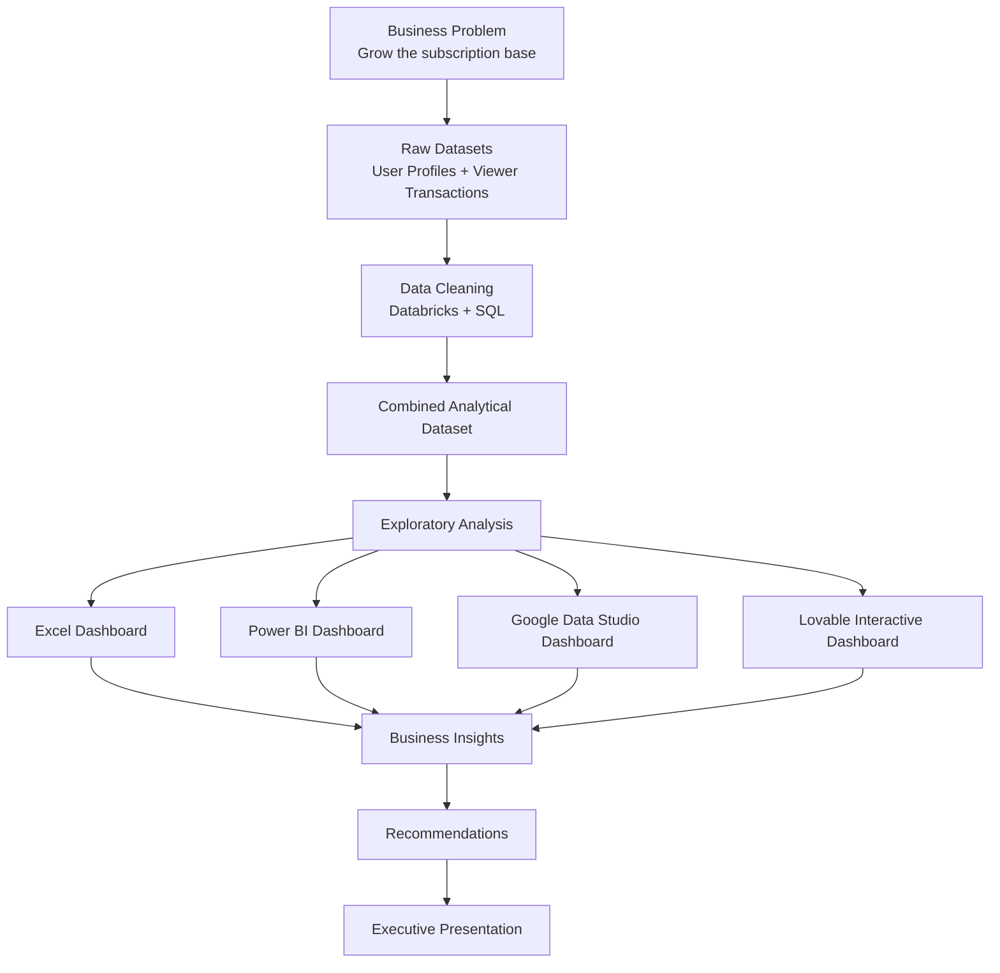

# 📺 BrightTV Viewership Analytics

---

## 📌 Project Overview

Welcome to the **BrightTV Viewership Analytics** project.

This project was developed as part of the **BrightTV Case Study**, and it follows an end-to-end analytics workflow: from understanding the business problem, through data cleaning and transformation in SQL, to dashboards, insights and executive recommendations.

BrightTV's CEO has set one priority for the financial year: **grow the subscription base**. The goal of this analysis was to help the Customer Value Management (CVM) team understand **who is watching, when they watch, what they watch, and where the growth opportunities are**.

### 🚀 From Viewers to Value

`Raw Data` → `Clean Data` → `Analysis` → `Visualisation` → `Insights` → `Recommendations`

---

## 🎯 Business Challenge

The CEO asked for insights to help the CVM team meet this year's subscription goal. The analysis was built around four questions:

- 📈 What are the **user and usage trends** on BrightTV?
- 🔍 What **factors influence consumption**?
- 📅 What **content should be recommended** on days with low consumption?
- 🌱 What **initiatives would grow the user base** further?

To answer them, the analysis looked at:

- 👥 Which audiences (age, gender, region) generate the most viewing
- 🗓️ Which days of the week and times of day are strongest and weakest
- 📡 Which channels attract the most sessions and the longest viewing
- ⏱️ How long subscribers actually watch per session
- 🔁 How many subscribers come back

The project used **SQL, Databricks, Excel, Power BI, Google Data Studio and Lovable** to move from raw datasets to decision-ready insights for a business audience.

---

## 📂 The Data

The analysis used two datasets:

- **User Profiles**: demographic and account-level information for each subscriber
- **Viewer Transactions**: one record per viewing session

Key fields in the analytical dataset:

- `Sub_ID`
- `sex`
- `Ethnicity`
- `Age_group`
- `Region`
- `email_flag`
- `Social_media_handle_flag`
- `RecordDate_SAST`
- `Tv_channel`
- `Duration`

Additional analytical fields were created during data transformation to support time-based and engagement analysis:

- `Watch_date`
- `Day_name`
- `Month_name`
- `Hour_of_day`
- `Day_classification`
- `Time_of_day`
- `Duration_seconds`
- `Duration_hours`
- `Screen_time_bucket`

**📊 Dataset at a glance**

| Measure | Value |
|---|---|
| Viewing sessions | 10,000 |
| Unique subscribers | 4,386 |
| Channels | 17 |
| Period covered | 1 January – 1 April 2016 |

> **Note:** The data covers a single quarter and contains no subscription start or cancellation dates, so growth is inferred from viewing activity rather than measured directly. Some demographic fields are `unknown`.

---

## 🔄 From Raw Data to Clean Data

Before any analysis, the raw data was cleaned and transformed using **SQL in Databricks**.

### 🧹 Data Cleaning & Transformation

The main preparation steps included:

#### 🕐 Converting UTC to South African Time

All dates and times in the source data are supplied in **UTC**, as the case study specified. They were converted to **South African Standard Time (SAST)** so that every time-based insight reflects when subscribers actually watched.

#### 🧾 Standardising Demographics

Missing or unrecognised values in sex, ethnicity and region were standardised to `unknown`, and subscribers were grouped into seven age bands:

- Infant: 0
- Kids: 1 – 12
- Youth: 13 – 17
- Youth Adults: 18 – 35
- Adults: 36 – 50
- Elder: 51 – 60
- Pensioner: over 60

#### 📅 Extracting Date and Time Parts

Each session was broken into:

- Watch date
- Weekday name
- Month
- Hour of day

This made it possible to analyse viewing by day, month and hour.

#### 🗓️ Weekday vs Weekend Classification

Each session was classified as:

- **Weekday**
- **Weekend**

This allowed viewing behaviour to be compared across the week.

#### 🌤️ Creating Time-of-Day Buckets

The day was divided into four time bands:

- 🌙 **Midnight** (00:00 – 05:59)
- 🌅 **Morning** (06:00 – 11:59)
- ☀️ **Afternoon** (12:00 – 16:59)
- 🌆 **Evening** (17:00 – 23:59)

#### ⏱️ Measuring Session Duration

Session length was converted into seconds and hours, then grouped into usage buckets:

- **No Usage**: under 5 minutes
- **Low Usage**: 5 – 30 minutes
- **Medium Usage**: 30 – 60 minutes
- **High Usage**: over 60 minutes

### 🗃️ Clean Analytical Dataset

The cleaned user profiles and viewer transactions were joined into **one analytical dataset**, which became the foundation for all dashboards and insights.

---

## 🧱 SQL & Databricks

SQL was used throughout the data preparation process.

Key techniques included:

- Joining user profiles to viewer transactions
- Converting timestamps from UTC to SAST
- Extracting date parts (weekday, month, hour)
- `CASE WHEN` logic for classifications and buckets
- Handling missing values
- Data type conversion
- Creating calculated fields

This stage demonstrated the importance of preparing reliable data before moving into visualisation and business analysis.

---

## 💡 Turning Data into Insights

Once the data had been cleaned and transformed, the next stage was to explore it and identify meaningful patterns.

The analysis focused on four main areas.

### 📈 User Growth & Engagement

Understanding how the subscriber base and usage changed over time:

- Active subscribers by month
- Sessions per subscriber
- One-time vs repeat viewers

### 📡 Content Performance

Identifying:

- Most-watched channels
- Channels with the longest sessions
- Differences in content appeal across audiences

### ⏰ Time-Based Performance

Understanding when viewing happens:

- Days of the week
- Weekday vs weekend
- Hour of day
- Time-of-day bands

### 🌍 Audience & Regional Performance

Understanding who is watching:

- Age groups
- Gender
- Provinces

---

## 📊 Dashboard Development

To demonstrate the ability to communicate insights through different business intelligence platforms, the analysis was developed across **four visualisation environments**.

### 📗 Microsoft Excel

Excel was used to develop the exploratory analysis and an interactive dashboard.

The Excel work included:

- Pivot tables
- KPI cards
- Sessions by month, weekday, hour and channel
- Audience breakdowns by age, gender and province
- Dashboard design

**Key Excel visualisations:**

- 📅 Sessions by Month
- 🗓️ Sessions by Day of the Week
- ⏰ Sessions by Hour of Day
- 📡 Sessions by Channel
- 👥 Sessions by Age Group and Gender
- 🌍 Sessions by Province

### 📊 Power BI

Power BI was used to develop a business intelligence version of the analysis.

The Power BI dashboard focused on:

- KPI cards
- Interactive filters
- Viewing trends over time
- Channel and audience performance
- Business-focused reporting

### 🌐 Google Data Studio

Google Data Studio was used to explore a cloud-based approach to publishing and sharing the analysis.

This provided additional experience with:

- Dashboard layout
- Interactive filtering
- Data visualisation
- Business reporting
- Visual storytelling

### 💻 Lovable Interactive Dashboard

The analysis was also transformed into a **web-based interactive dashboard** using **Lovable**.

The dashboard follows the same analytical framework as the other platforms while presenting the information in a modern, web-based environment.

#### 🔗 Live Dashboard

👉 [**Open the BrightTV Interactive Dashboard**](https://lovable.dev/projects/79ce533b-2f86-432c-b886-1c6b6d5c297b)

---

## 🧠 Business Insights

### 📈 User Growth & Engagement

- Active subscribers grew from **1,164 in January to 2,545 in March**, and sessions rose from 2,199 to 4,816.
- The dataset contains about **1,523 hours** of viewing across 10,000 sessions.
- The typical session is short: the median is under 2 minutes, and **69% of sessions last under 5 minutes**.
- **51% of subscribers watched only once** in the period, so repeat viewing is a major opportunity.

### 📡 Content Performance

- **Live Events (18%)** and **ICC Cricket World Cup 2011 (15%)** are the most-watched channels, followed by Channel O, Trace TV and SuperSport Blitz.
- ICC Cricket World Cup 2011 sessions average about **17 minutes**, against roughly 9 minutes overall, so live sport holds attention the longest.
- The kids' channels (Cartoon Network and Boomerang) together account for about **15%** of sessions.

### ⏰ Viewing Patterns

- Afternoon and evening produce **71%** of sessions, and every hour from midday to about 9 pm carries a similar, high load.
- Afternoon sessions are the longest of any time band, at about 10.6 minutes on average.
- **Saturday** is the strongest day: about 296 hours of viewing and the longest sessions (about 11 minutes).
- **Monday** is the weakest: 957 sessions (against 1,322 – 1,675 on other days), about 115 hours of viewing and the shortest sessions (about 7 minutes). Sunday and Tuesday are next weakest by total viewing time.

### 👥 Audience Profile

- **18 – 35 year olds** generate 60% of sessions, and **36 – 50 year olds** a further 30%.
- **Males generate 88%** of sessions; women, under-18s and over-50s are all small segments.
- **Gauteng (37%)**, the **Western Cape (18%)** and **KwaZulu-Natal (10%)** lead by region.

---

## 🎯 Business Recommendations

Based on the analytical findings, the following strategies are recommended to support subscription growth.

### 1. 📅 Fix Monday with Long-Session Content

Schedule live events and tournament-style coverage on Mondays. This is the content type that holds viewers longest, and Monday is the weakest day.

### 2. 🔔 Build Appointment Viewing

Create fixed Monday and Tuesday programming slots, supported by reminders and notifications, to turn low-consumption days into a habit.

### 3. ⏰ Promote When Viewers Are Active

Concentrate campaigns, reminders and promotions between midday and 9 pm, when subscribers are most active.

### 4. 🔁 Turn One-Time Viewers into Repeat Viewers

With over half of subscribers watching only once, introduce follow-up nudges and personalised content suggestions after a first session.

### 5. 👨‍👩‍👧 Broaden the Audience

Target the groups the base barely reaches: **women, over-50s and families**. The kids' channels already account for about 15% of sessions, which suggests demand for family content.

### 6. 🌍 Grow Beyond Gauteng and the Western Cape

Use region-relevant content and campaigns to build the subscriber base in provinces with lower viewing volumes.

---

## 🗺️ Project Planning

The project's planning and analytical workflow were supported using **Miro** and **Canva**.

### 🧩 Miro

Miro was used for:

- Project planning
- Process mapping
- Data flow visualisation
- Structuring the analytical workflow

### 🎨 Canva

Canva was used to create:

- Project Gantt chart
- Timeline visualisation
- Planning materials

These tools helped structure the project from the data stage through to the final presentation.

---

## 🎤 Executive Presentation

The final analysis was prepared for executive review using **Microsoft PowerPoint**.

The presentation focuses on translating the analytical findings into:

- User and usage trends
- Factors that influence consumption
- Content recommendations for low-consumption days
- Initiatives to grow the user base

The objective was to communicate the analysis clearly, so that it could be understood by a non-technical audience.

---

## 🧰 Skills Demonstrated

This project demonstrates practical experience across the full data analytics lifecycle.

### 📊 Data Analytics

- Data cleaning
- Data transformation
- Exploratory data analysis
- Audience and segment analysis
- Time-based analysis
- Content performance analysis
- Business analysis
- Data storytelling

### 🗄️ SQL

- Table joins
- Date and time functions
- Time zone conversion
- Conditional logic
- Calculated fields
- Data transformation

### 🧱 Databricks

- Data preparation
- SQL-based transformations
- Analytical dataset creation

### 📗 Excel

- Pivot tables
- KPI cards
- Dashboard development
- Interactive reporting

### 📊 Power BI

- Interactive dashboards
- KPI cards
- Business intelligence
- Data visualisation

### 🎨 Data Visualisation

- Dashboard design
- Visual hierarchy
- Interactive reporting
- Data storytelling

### 💬 Business Communication

- Executive reporting
- Business recommendations
- PowerPoint presentation
- Translating data into business language

### 🗺️ Project Planning

- Miro
- Process mapping
- Gantt charts
- Project workflow planning

---

## 🔁 End-to-End Analytics Journey

---

## 📦 Project Deliverables

The project includes the following key deliverables:

- 📗 Excel Dashboard
- 📊 Power BI Dashboard
- 🌐 Google Data Studio Dashboard
- 💻 Lovable Interactive Dashboard
- 🗃️ Cleaned and Combined Dataset
- 🧱 SQL Code (cleaning and combined queries)
- 🧩 Miro Project Planning / Data Flow
- 🎨 Canva Gantt Chart
- 🎤 PowerPoint Executive Presentation

### 🔗 Live Lovable Dashboard

👉 [**Open the BrightTV Interactive Dashboard**](https://lovable.dev/projects/79ce533b-2f86-432c-b886-1c6b6d5c297b)

> **Note:** The Lovable dashboard is provided as a live interactive application because the platform does not provide a PDF export of the dashboard.

---

## 🏁 Project Outcome

The BrightTV Viewership Analytics project demonstrates how raw viewing data can be transformed into meaningful business insights through a structured analytics process.

The project brings together:

**SQL • Databricks • Data Preparation • Excel • Power BI • Data Studio • Lovable • Business Insights • Executive Reporting**

The key objective was not simply to create dashboards, but to demonstrate the complete process of:

**Cleaning the data → Understanding the data → Finding patterns → Communicating insights → Recommending action**

This project demonstrates my ability to work across multiple analytics platforms while maintaining a consistent business objective.

---

## 🚀 Future Improvements

Future enhancements could include:

- 🔄 Adding subscription start and cancellation dates to measure churn and acquisition directly
- 🔮 Developing predictive models for consumption and subscriber retention
- 👥 Building customer segments using viewing behaviour
- 🎬 Adding genre and programme-level content data
- 📆 Extending the analysis beyond one quarter to capture seasonality
- 🧪 Testing the recommendations through pilot campaigns or A/B tests
- ⚙️ Automating data refreshes and connecting dashboards to live data
- 🌐 Further developing the web-based dashboard application

---

## 👤 Project Author

**Lerato Legodi**

Data Analytics Portfolio Project

**BrightTV Case Study — 2026**

### 📺 From Viewership to Growth

*Turning viewing data into subscriber growth strategy.*
